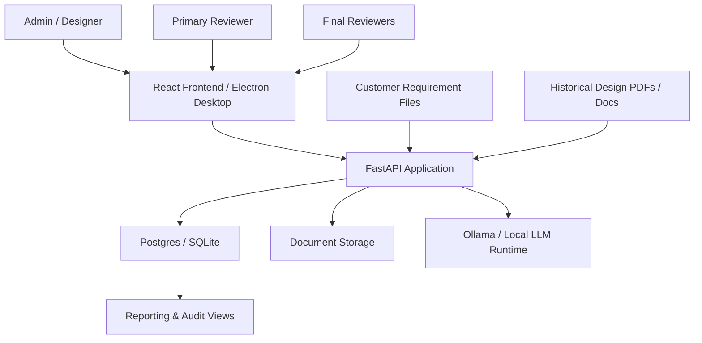
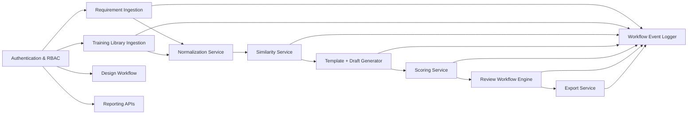
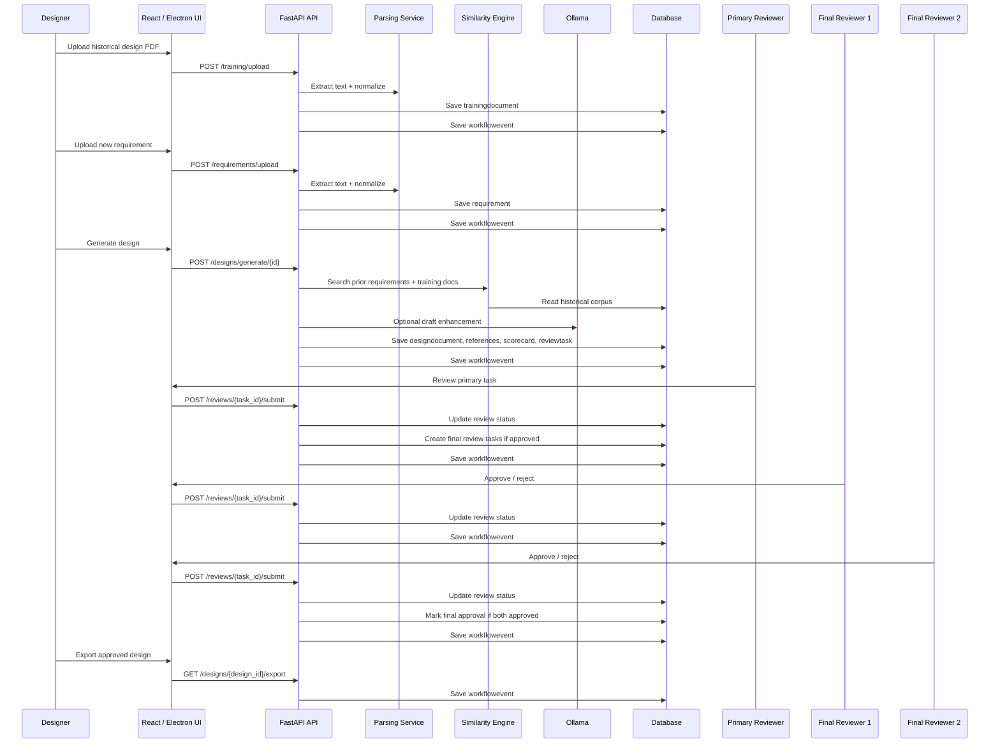
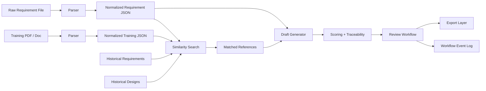
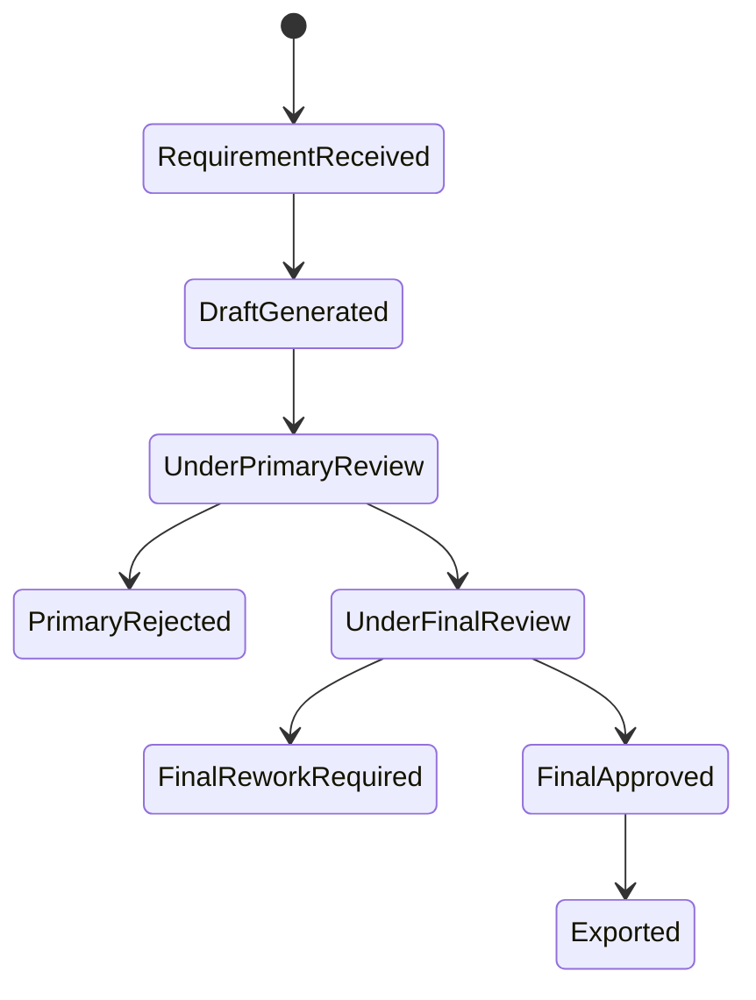
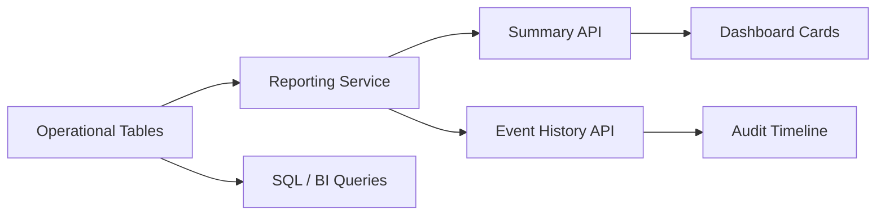

# Architecture

This document describes the end-to-end architecture of NIITSyllabriq, including the ingestion pipeline, retrieval and generation flow, review lifecycle, and reporting model.

## 1. System Context

## 2. Logical Components

## 3. End-to-End Requirement-to-Design Flow

## 4. Data Flow

## 5. Review State Model

## 6. Persistence Model

Primary operational tables:

- `user`
- `trainingdocument`
- `requirement`
- `designdocument`
- `retrievedreference`
- `scorecard`
- `reviewtask`
- `workflowevent`

### Purpose of each table

- `trainingdocument`: stores historical or baseline documents uploaded for reuse
- `requirement`: stores normalized customer requirement inputs
- `designdocument`: stores generated draft and final design outputs
- `retrievedreference`: stores which prior requirement or training doc was reused
- `scorecard`: stores scoring and coverage results
- `reviewtask`: stores assigned approval tasks and review outcomes
- `workflowevent`: stores an immutable-style audit trail of important actions

## 7. Reporting Architecture

## 8. Deployment Topologies

### Desktop-first

- FastAPI on local machine
- SQLite
- Ollama locally
- Electron shell

### Shared internal deployment

- FastAPI behind reverse proxy
- Postgres
- shared file storage
- React served internally
- Ollama on internal GPU or inference workstation

### Hybrid

- local generation where needed
- central API and Postgres for workflow and reporting

## 9. Security Boundaries

- Authentication gates every business API except health/login
- Role-based access controls separate design authors from reviewers
- Workflow events create a traceable operational history
- Local-first model support reduces exposure of sensitive documents to external hosted LLMs

## 10. Recommended Next Enterprise Enhancements

- SSO / LDAP
- queue-based background processing
- centralized logging and metrics
- antivirus / content scanning
- branded DOCX/PDF formatting layer
- object storage abstraction for large-file management
