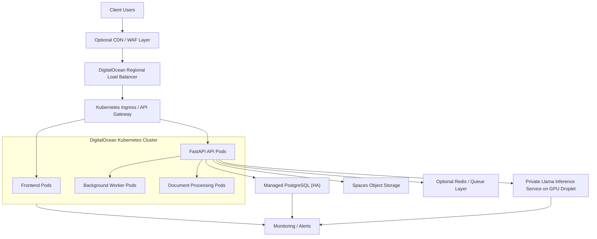

# DigitalOcean Enterprise Deployment Guide

This document describes a production-ready deployment approach for NIITSyllabriq on DigitalOcean, including the recommended infrastructure, uptime strategy, cost guidance, and step-by-step procedure.

It also includes a separate section for deploying Meta Llama on DigitalOcean as part of the product.

## 1. Executive Recommendation

For a client-facing SaaS version of NIITSyllabriq on DigitalOcean, the best default production architecture is:

- DigitalOcean Kubernetes (DOKS) for the application tier
- Managed PostgreSQL for the transactional database
- Spaces for document storage
- Container Registry (DOCR) for images
- Regional Load Balancer for public traffic
- VPC for private east-west communication
- Monitoring and alerts enabled from day one
- Separate GPU Droplet for Llama inference

This gives the best balance of:

- uptime
- easier scaling
- predictable operations
- clean separation between app and AI inference
- better resale position for enterprise clients

## 2. Recommended Production Topology



## 3. Uptime Strategy

### Minimum production standard

- DOKS cluster with high availability enabled for the control plane
- minimum 3 worker nodes
- regional load balancer in front of the cluster
- managed PostgreSQL in high-availability mode
- readiness and liveness probes on every app service
- horizontal pod autoscaling for API and worker pods
- node autoscaling for the DOKS node pool
- all internal traffic over a VPC
- document storage moved out of local disks and into Spaces
- monitoring and alerting enabled

### Premium enterprise standard

Add:

- separate production and staging clusters
- private Llama inference endpoint on a GPU Droplet
- warm standby deployment in a second region
- Global Load Balancer in front of both regions
- automated database export / backup verification
- IaC for repeatable deployment

## 4. Why This Architecture

### Why DOKS instead of plain Droplets

Because DOKS gives you:

- managed control plane
- high availability option
- autoscaling
- cleaner rolling deployments
- easier multi-service operations

DigitalOcean documents DOKS as a managed Kubernetes service with high availability and autoscaling, and charges only for worker nodes, which are billed at Droplet rates.

### Why Managed PostgreSQL instead of self-hosted Postgres

Because Managed PostgreSQL gives you:

- daily backups with point-in-time recovery
- standby nodes for HA
- automated failover
- SSL encryption

That is a much better SaaS posture than running Postgres yourself on a VM.

### Why a separate GPU Droplet for Llama

Because GPU inference is:

- expensive
- operationally distinct
- easier to scale independently

Keeping GPU inference outside the main Kubernetes cluster makes the system simpler to manage and easier to cost-control.

## 5. Recommended Infrastructure Blueprint

### Option A: Recommended baseline production

#### Network and platform

- 1 VPC in the primary region
- 1 DOKS cluster with HA control plane
- 1 worker node pool with autoscaling
- 1 regional load balancer
- 1 managed PostgreSQL cluster in HA mode
- 1 Spaces subscription
- 1 DOCR registry
- DigitalOcean Monitoring enabled
- DigitalOcean Cloud Firewalls enabled

#### App tier sizing

Start with:

- 3 worker nodes
- each node: 4 GB RAM / 2 vCPU

This is a good starting point for:

- frontend
- FastAPI
- background workers
- document processing

#### AI tier sizing

Start Llama on a separate GPU Droplet only if the client is paying for hosted inference.

If traffic is low at the start, do not keep a large GPU online 24/7 unless you have a clear revenue model for it.

## 6. Rough Cost Model

These are rough infrastructure estimates based on current official DigitalOcean pricing pages.

### Core production stack

- DOKS worker nodes are billed at Droplet rates
- example 4 GB / 2 vCPU Basic Droplet: about `$24/month` each
- 3 such worker nodes: about `$72/month`
- regional HTTP load balancer: `$12/month` per node
- managed PostgreSQL HA starts around `$30/month` for the 2 GB primary plus at least one matching `$30/month` standby, so about `$60/month` minimum
- Spaces: `$5/month`
- DOCR Basic: `$5/month`
- Monitoring: no additional cost
- Firewalls: no additional cost
- VPC traffic: free within a VPC

### Baseline total

Expected baseline:

- app cluster: `$72`
- load balancer: `$12`
- managed PostgreSQL HA: `$60`
- Spaces: `$5`
- DOCR: `$5`

Approximate total:

- about `$154/month` before extra bandwidth, extra storage, backups outside the managed defaults, or GPU inference

### Llama GPU costs

Current DigitalOcean GPU hourly examples:

- NVIDIA RTX 4000: `$0.76/hour`
- NVIDIA L40s: `$1.57/hour`
- NVIDIA H100: `$3.39/hour`

Approximate 24x7 monthly equivalents at roughly 730 hours:

- RTX 4000: about `$555/month`
- L40s: about `$1,146/month`
- H100: about `$2,475/month`

This is why I recommend:

- keep hosted Llama optional
- meter it separately
- or start with a lower-cost GPU only for premium clients

## 7. Best Region Strategy

### Primary recommendation

Choose one region and keep all main services there:

- DOKS
- Managed PostgreSQL
- Spaces
- GPU Droplet

This reduces:

- latency
- cross-region complexity
- failure points

### Disaster recovery recommendation

For premium clients:

- replicate deployment assets in a second region
- deploy a standby cluster there
- use a Global Load Balancer in front

DigitalOcean Global Load Balancers cost `$15/month` and include request and transfer quotas.

## 8. Step-by-Step Deployment Procedure

## Phase 1: Account and project setup

### Step 1: Create team and project structure

In DigitalOcean:

1. Create a dedicated team for production.
2. Create separate projects:
   - `niitsyllabriq-prod`
   - `niitsyllabriq-staging`
3. Add only the required engineers and billing admins.

### Step 2: Create a VPC

1. Go to Networking.
2. Create a VPC in your selected primary region.
3. Use this VPC for:
   - DOKS
   - Managed PostgreSQL
   - GPU Droplet

Use one private network boundary per environment.

### Step 3: Enable monitoring baseline

Enable DigitalOcean Monitoring for all compute resources and configure alerts for:

- CPU
- memory
- disk
- node unavailability
- DB saturation
- GPU health if using Llama hosting

## Phase 2: Image and storage setup

### Step 4: Create a Container Registry

1. Create a DOCR registry.
2. Use at least the Basic plan.
3. Push:
   - frontend image
   - backend API image
   - worker image

Use immutable version tags plus release tags:

- `api:1.0.0`
- `api:release-2026-05-01`

### Step 5: Create Spaces buckets

Create separate buckets for:

- `prod-requirements`
- `prod-design-exports`
- `prod-training-documents`
- `prod-backups-archive` if you export additional files

Store:

- uploaded requirements
- training PDFs
- generated deliverables
- audit exports if needed

## Phase 3: Database setup

### Step 6: Create Managed PostgreSQL

1. Choose PostgreSQL.
2. Place it in the same VPC as the app cluster.
3. Choose high availability mode.
4. Start with at least the 2 GB / 1 vCPU HA entry level if production.
5. Enable trusted IPs only where necessary.
6. Force SSL connections from application pods.

Create:

- one database for production
- one least-privileged app user
- one separate admin user for migrations

### Step 7: Apply migrations

From your CI/CD pipeline or a one-off job:

```bash
alembic upgrade head
```

Run migrations before switching traffic to new app versions.

## Phase 4: Kubernetes cluster setup

### Step 8: Create DOKS cluster

Create a DOKS cluster with:

- HA control plane enabled
- same region as DB and Spaces
- node autoscaling enabled

Recommended starting worker pool:

- size: 4 GB / 2 vCPU
- min nodes: `3`
- max nodes: `6`

For better separation, create node pools for:

- general web/API traffic
- background processing

### Step 9: Configure namespaces

Create namespaces:

- `frontend`
- `backend`
- `workers`
- `observability`

This keeps workloads easier to operate and secure.

### Step 10: Install ingress and certificates

Deploy:

- ingress controller
- cert-manager if you want in-cluster certificate automation

Or terminate TLS at the DigitalOcean Load Balancer.

For most SaaS teams:

- LB termination is simpler
- Kubernetes ingress still manages routing inside the cluster

### Step 11: Configure secrets

Create secrets for:

- database URL
- JWT secret
- Spaces keys
- email / notification credentials
- any external AI provider keys if used

Do not hardcode secrets in images or GitHub Actions YAML.

## Phase 5: Application deployment

### Step 12: Deploy frontend

Deploy the React frontend as:

- NGINX static container
- 2 replicas minimum

Expose via ingress route:

- `/`

### Step 13: Deploy backend API

Deploy FastAPI as:

- `2` replicas minimum
- readiness probe
- liveness probe
- rolling updates enabled

Expose via ingress route:

- `/api`

### Step 14: Deploy worker pods

Deploy separate worker pods for:

- document parsing
- scoring
- background workflows

Do not mix heavy worker processing into the same deployment as the public API.

### Step 15: Configure autoscaling

Set:

- HPA on API
- HPA on workers
- Cluster Autoscaler on node pools

Use production metrics to tune thresholds after launch.

## Phase 6: Public traffic and security

### Step 16: Create the Load Balancer

Create a regional HTTP load balancer and point it to the cluster ingress.

Configure:

- HTTPS forwarding
- health checks
- sticky sessions only if absolutely needed
- HTTP to HTTPS redirect

### Step 17: Configure firewalls

Create Cloud Firewall rules:

- allow `80/443` only where required
- block public DB access
- restrict GPU Droplet access to VPC or specific source ranges
- allow SSH only from admin IPs or VPN

### Step 18: Configure DNS

Point:

- `app.yourdomain.com`
- `api.yourdomain.com`

to the load balancer or fronting CDN/WAF layer.

For stronger enterprise posture, place Cloudflare or another WAF in front of the DigitalOcean endpoint.

## Phase 7: Llama deployment on DigitalOcean

## Recommended approach

Do not run hosted Llama inside the main Kubernetes cluster first.

Instead:

- deploy it on a dedicated GPU Droplet
- keep it in the same VPC
- expose it privately to the backend

This is the cleanest way to control:

- cost
- scaling
- GPU operational issues
- app isolation

## Option A: Fastest setup

Use DigitalOcean 1-Click Models.

DigitalOcean documents that 1-Click Models let you deploy models such as Meta Llama 3 directly on GPU Droplets and begin querying model endpoints immediately after provisioning.

### Steps

1. Create a GPU Droplet.
2. In image selection, choose `1-Click Models`.
3. Select a Meta Llama model.
4. Choose the GPU size.
5. Attach it to the production VPC.
6. Restrict access with Cloud Firewall rules.
7. Test the model endpoint from the backend.

Use this if:

- you want the fastest route
- you are okay with a more appliance-style inference deployment

## Option B: Recommended production setup

Use the inference-optimized NVIDIA GPU image.

DigitalOcean’s recommended GPU setup documentation states that the inference-optimized image includes:

- Docker
- vLLM
- model bootstrap tooling through `run_model.sh`

### Steps

1. Create a GPU Droplet.
2. Choose the inference-optimized NVIDIA image.
3. Place it inside the same VPC as the app cluster.
4. SSH into the host.
5. Run the provided `run_model.sh` bootstrap.
6. Pull the Llama model you want.
7. Expose the inference API only on the private network.
8. Configure your FastAPI backend to call the private inference endpoint.

This is better if you want:

- more control
- easier model replacement
- standard OpenAI-style serving through vLLM

## Suggested initial GPU sizing

If this feature is client-funded and inference volume is modest:

- start with `RTX 4000`

If you need stronger throughput for a real paid AI tier:

- move to `L40s`

Only use `H100` if you truly need heavy production inference and the client economics support it.

## Phase 8: Operations, backups, and upgrades

### Step 19: Backup strategy

Use:

- Managed PostgreSQL backups and PITR
- Spaces for durable document storage
- image versioning in DOCR
- exported infrastructure manifests in Git

For the GPU Droplet:

- store configuration as code
- avoid treating the VM itself as the source of truth
- rebuild from image and model config when possible

### Step 20: Observability

Track:

- DOKS node CPU and memory
- pod restarts
- LB health
- DB connections and saturation
- worker queue backlog
- model latency and GPU utilization

Create alerts for:

- API 5xx spike
- ingress unavailable
- DB CPU/memory saturation
- GPU inference endpoint failure

### Step 21: Deployment procedure

For every release:

1. build images
2. push to DOCR
3. run migrations
4. deploy to staging
5. run smoke tests
6. deploy to production with rolling update
7. verify health checks
8. verify DB migrations
9. verify inference connectivity if Llama is enabled

## 9. Recommended Environment Layout

### Staging

- separate DOKS cluster or smaller node pool
- separate managed PostgreSQL cluster
- separate Spaces buckets
- no production client data

### Production

- dedicated DOKS cluster
- dedicated managed PostgreSQL
- dedicated Spaces buckets
- optional dedicated GPU inference host

## 10. Optional Premium Disaster Recovery Design

For higher-end clients:

- duplicate production stack in a second DigitalOcean region
- add Global Load Balancer in front
- replicate release artifacts and object storage procedures
- maintain standby inference deployment only if the client pays for it

Use this as a premium enterprise add-on, not the default offering.

## 11. What I Recommend You Sell

### Standard SaaS plan

- single region
- DOKS
- managed PostgreSQL HA
- Spaces
- no hosted Llama
- client uses local model or shared AI pool

### Premium SaaS plan

- single region
- DOKS
- managed PostgreSQL HA
- Spaces
- hosted Llama on dedicated GPU Droplet
- stronger support SLA

### Enterprise plan

- single tenant
- isolated production project
- managed PostgreSQL HA
- dedicated GPU inference if required
- optional warm standby region

## 12. Final Recommendation

If you want the best balance of uptime, professionalism, and maintainability on DigitalOcean:

- use DOKS for the app tier
- use Managed PostgreSQL for the database
- use Spaces for document storage
- use DOCR for images
- use a separate GPU Droplet for Llama
- start with one region and HA
- offer second-region DR only as a premium tier

That is the cleanest enterprise-ready DigitalOcean story for this product.

## 13. Official DigitalOcean Sources

- DOKS pricing: [https://docs.digitalocean.com/products/kubernetes/details/pricing/](https://docs.digitalocean.com/products/kubernetes/details/pricing/)
- DOKS HA: [https://docs.digitalocean.com/products/kubernetes/how-to/enable-high-availability/](https://docs.digitalocean.com/products/kubernetes/how-to/enable-high-availability/)
- DOKS autoscaling: [https://docs.digitalocean.com/products/kubernetes/how-to/autoscale/](https://docs.digitalocean.com/products/kubernetes/how-to/autoscale/)
- HPA guidance: [https://docs.digitalocean.com/products/kubernetes/how-to/set-up-autoscaling/](https://docs.digitalocean.com/products/kubernetes/how-to/set-up-autoscaling/)
- Droplet pricing: [https://docs.digitalocean.com/products/droplets/details/pricing/](https://docs.digitalocean.com/products/droplets/details/pricing/)
- Droplet features: [https://docs.digitalocean.com/products/droplets/details/features/](https://docs.digitalocean.com/products/droplets/details/features/)
- Managed databases overview: [https://docs.digitalocean.com/products/databases/index.html](https://docs.digitalocean.com/products/databases/index.html)
- PostgreSQL pricing: [https://docs.digitalocean.com/products/databases/postgresql/details/pricing/](https://docs.digitalocean.com/products/databases/postgresql/details/pricing/)
- Load balancer details: [https://docs.digitalocean.com/products/networking/load-balancers/details/](https://docs.digitalocean.com/products/networking/load-balancers/details/)
- Load balancer pricing: [https://docs.digitalocean.com/products/networking/load-balancers/details/pricing/](https://docs.digitalocean.com/products/networking/load-balancers/details/pricing/)
- VPC details: [https://docs.digitalocean.com/products/networking/vpc/details/](https://docs.digitalocean.com/products/networking/vpc/details/)
- Firewalls details: [https://docs.digitalocean.com/products/networking/firewalls/details/](https://docs.digitalocean.com/products/networking/firewalls/details/)
- Monitoring details: [https://docs.digitalocean.com/products/monitoring/details/](https://docs.digitalocean.com/products/monitoring/details/)
- Container Registry pricing: [https://docs.digitalocean.com/products/container-registry/details/pricing/](https://docs.digitalocean.com/products/container-registry/details/pricing/)
- Spaces pricing: [https://docs.digitalocean.com/products/spaces/details/pricing/](https://docs.digitalocean.com/products/spaces/details/pricing/)
- Backups pricing: [https://docs.digitalocean.com/products/backups/details/pricing/](https://docs.digitalocean.com/products/backups/details/pricing/)
- GPU Droplets overview: [https://docs.digitalocean.com/products/gpu-droplets/](https://docs.digitalocean.com/products/gpu-droplets/)
- GPU Droplet setup: [https://docs.digitalocean.com/products/droplets/how-to/gpu/](https://docs.digitalocean.com/products/droplets/how-to/gpu/)
- Recommended GPU setup: [https://docs.digitalocean.com/products/droplets/getting-started/recommended-gpu-setup/](https://docs.digitalocean.com/products/droplets/getting-started/recommended-gpu-setup/)
- 1-Click Models: [https://docs.digitalocean.com/products/marketplace/1-click-models/](https://docs.digitalocean.com/products/marketplace/1-click-models/)
