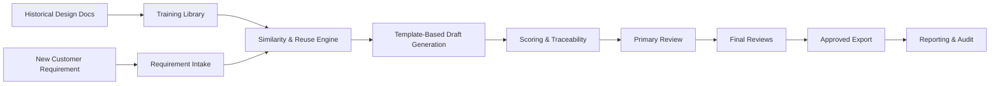

# Executive Summary

## Overview

NIITSyllabriq is a governed design automation platform that helps teams convert customer requirements into reviewable, reusable, and auditable solution design documents.

The platform is designed for teams that already operate with:

- standard templates
- recurring design patterns
- mandatory human review gates
- the need to report on delivery quality and process status

## Business Value

- Reduces time spent drafting repetitive design documents
- Improves reuse of historical project knowledge
- Standardizes outputs through a defined NIIT design template
- Enforces review and approval workflows before customer delivery
- Captures a database-level audit trail for governance and reporting
- Enables local-first or cost-conscious deployment without mandatory external SaaS dependencies

## What The Platform Does

1. Ingests historical design PDFs and documents into a training library
2. Ingests new customer requirements
3. Normalizes both into structured content
4. Finds similar prior work through retrieval
5. Reuses relevant content where confidence is high
6. Generates a structured draft in the NIIT format
7. Scores coverage, completeness, and readiness
8. Routes the design through primary and final review
9. Exports approved documents and records every key action for reporting

## Operating Model

### Roles

- Admin: manages setup, users, training documents, and reporting
- Designer: uploads requirements and generates drafts
- Primary Reviewer: validates initial technical and business alignment
- Final Reviewers: provide final sign-off before customer delivery

### Governance

- Human review is mandatory
- Two final reviewers are required for completion
- All major actions are logged into the database
- Reuse references and scores remain visible for audit

## Architecture Snapshot

## Deployment Options

### Local-first desktop

- suited to privacy-sensitive use cases
- low recurring cost
- works well for pilot teams

### Shared internal server

- better for collaboration and centralized reporting
- recommended for multi-user workflows

### Hybrid

- balances local drafting with central governance and reporting

## Reporting Coverage

The platform tracks:

- training document uploads
- requirement uploads
- design generation events
- similarity and reuse decisions
- approval and rejection actions
- export activity
- scoring outcomes

## Current Status

The repository already includes:

- backend APIs
- React frontend
- Electron shell
- export support
- migrations
- workflow reporting

Recommended next enterprise enhancements:

- SSO / LDAP
- centralized monitoring
- queue-based background jobs
- advanced document branding
- security scanning for uploads
