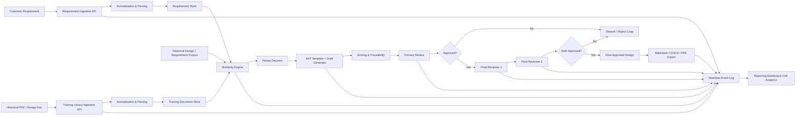

# NIITSyllabriq

[](./pyproject.toml)
[](./app)
[](./frontend)
[](./desktop)
[](./alembic)
[](#)

NIITSyllabriq is a local-first, enterprise-oriented design automation platform for turning customer requirements into governed solution design documents.

It combines retrieval, template-driven generation, human review, approval workflows, document export, and database-level reporting into one operating model that can run on a desktop, an internal server, or a hybrid setup.

## Executive Summary

For a concise leadership-ready overview, see [EXECUTIVE_SUMMARY.md](./EXECUTIVE_SUMMARY.md).

## Why This Project Exists

Most design teams already have:

- customer requirement documents
- standard delivery templates
- historical design documents with reusable knowledge
- mandatory reviewer and approver workflows
- a need for auditability, quality scoring, and delivery readiness

NIITSyllabriq packages those needs into a single workflow:

1. ingest a new requirement
2. compare it to historical and trained documents
3. reuse the closest relevant content
4. generate a draft in the NIIT template
5. route it through human review and final sign-off
6. export the approved deliverable
7. record each step for operational reporting

## Core Capabilities

- Requirement ingestion from `txt`, `md`, `pdf`, and `docx`
- Training library ingestion for historical design documents
- Similarity search across requirements and trained document baselines
- Template-guided design generation with optional Ollama-based local LLM support
- Role-based access for admins, designers, primary reviewers, and final reviewers
- One primary review plus two final reviewer approvals
- Design quality scoring and traceability
- Export to Markdown, DOCX, and PDF
- React frontend and Electron desktop shell
- Postgres-ready persistence with Alembic migrations
- Workflow-event logging for audit and reporting

## Architecture

The full architecture is documented in [ARCHITECTURE.md](./ARCHITECTURE.md).

### End-to-End Flow



## Platform At A Glance

| Area | What It Does |
| --- | --- |
| Training Library | Ingests historical PDFs and design documents to seed reusable knowledge |
| Requirement Intake | Parses new customer requirements into normalized structured content |
| Retrieval Layer | Matches new requirements against prior requirements and training documents |
| Draft Generation | Produces NIIT-template drafts with optional local LLM enhancement |
| Human Governance | Routes drafts through primary review and two final approvals |
| Export Layer | Produces Markdown, DOCX, and PDF outputs |
| Reporting | Tracks workflow events, approval states, scores, and reuse references in the database |

## Technology Stack

### Backend

- FastAPI
- SQLModel / SQLAlchemy
- Alembic
- Postgres or SQLite
- Ollama integration for local model inference

### Frontend

- React
- Vite

### Desktop

- Electron

### Document Handling

- `python-docx`
- `pypdf`

## Repository Structure

```text
app/
  api/              FastAPI routes
  core/             config and security
  db/               engine and session setup
  models/           database models
  schemas/          API contracts
  services/         business logic
  templates/        NIIT document template
frontend/           React application
desktop/            Electron wrapper
alembic/            database migrations
tests/              API and workflow tests
```

## Quick Start

### Docker Compose with Local LLM

```bash
docker compose up --build
docker compose exec ollama ollama pull qwen2.5:7b-instruct
docker compose exec ollama ollama pull nomic-embed-text
```

Then open the frontend at [http://localhost:5173](http://localhost:5173). See [LOCAL_LLM_DEPLOYMENT.md](./LOCAL_LLM_DEPLOYMENT.md) for model choices and production settings.

### 1. Clone the repository

```bash
git clone https://github.com/SandeepRDiddi/NIITSyllabriq.git
cd NIITSyllabriq
```

### 2. Start the backend

```bash
python3 -m venv .venv
source .venv/bin/activate
pip install -e .[dev]
cp .env.example .env
alembic upgrade head
uvicorn app.main:app --reload
```

Backend endpoints:

- Swagger UI: [http://localhost:8000/docs](http://localhost:8000/docs)
- OpenAPI JSON: [http://localhost:8000/openapi.json](http://localhost:8000/openapi.json)

### 3. Start the frontend

```bash
cd frontend
npm install
npm run dev
```

Frontend URL:

- [http://localhost:5173](http://localhost:5173)

### 4. Start the desktop shell

```bash
cd desktop
npm install
npm start
```

## Default Accounts

- `admin@niit.com / Admin@123`
- `designer@niit.com / Designer@123`
- `primary.reviewer@niit.com / Reviewer@123`
- `final.reviewer1@niit.com / Reviewer@123`
- `final.reviewer2@niit.com / Reviewer@123`

## Recommended Demo Flow

For the full operator walkthrough, use [PRODUCTION_FLOW_GUIDE.md](./PRODUCTION_FLOW_GUIDE.md).

The shortest useful demo is:

1. Log in as admin
2. Upload one historical PDF into the training library
3. Upload a new customer requirement
4. Generate a draft design
5. Review similarity match and score
6. Approve as primary reviewer
7. Approve as both final reviewers
8. Export the final design
9. Open reporting summary and workflow-event history

## Documentation Map

- [ARCHITECTURE.md](./ARCHITECTURE.md): complete system and flow diagrams
- [EXECUTIVE_SUMMARY.md](./EXECUTIVE_SUMMARY.md): one-page business and technical summary
- [PRODUCTION_FLOW_GUIDE.md](./PRODUCTION_FLOW_GUIDE.md): operator walkthrough for the full lifecycle
- [SETUP_GUIDE.md](./SETUP_GUIDE.md): environment and local setup details
- [LOCAL_LLM_DEPLOYMENT.md](./LOCAL_LLM_DEPLOYMENT.md): Ollama deployment, production env, and model recommendations
- [design-automation-architecture.md](./design-automation-architecture.md): earlier solution architecture notes

## API Highlights

### Authentication

- `POST /auth/login`
- `GET /auth/me`

### Training Library

- `POST /training/upload`
- `GET /training`

### Requirements

- `POST /requirements/upload`
- `GET /requirements`

### Designs

- `POST /designs/generate/{requirement_id}`
- `GET /designs`
- `GET /designs/{design_id}`
- `GET /designs/{design_id}/export`

### Reviews

- `GET /reviews`
- `POST /reviews/{task_id}/submit`

### Reporting

- `GET /reports/summary`
- `GET /reports/events`

## Deployment Modes

### Local Desktop

Best for:

- offline or semi-offline use
- data privacy on individual machines
- small teams or pilot rollouts

Typical stack:

- FastAPI
- SQLite
- Ollama
- Electron shell

### Shared Internal Server

Best for:

- centralized review workflows
- shared training and requirement corpus
- stronger reporting and governance

Typical stack:

- FastAPI
- Postgres
- shared file storage
- React frontend
- Ollama on an internal GPU workstation or private inference host

### Hybrid

Best for:

- local drafting with shared governance
- sensitive document handling
- centralized reporting with distributed generation

## Development and Validation

Run the automated test suite:

```bash
python3 -m pytest -q
```

## Production Readiness Notes

This repository provides a strong production-style foundation, but enterprise hardening should still include:

- SSO or LDAP integration
- centralized logging and monitoring
- background workers for large document jobs
- malware scanning for uploads
- encrypted storage and backup policies
- refined branded export templates
- infrastructure observability and alerting

# PR Agent Integration Test

# PR Agent Integration Test
